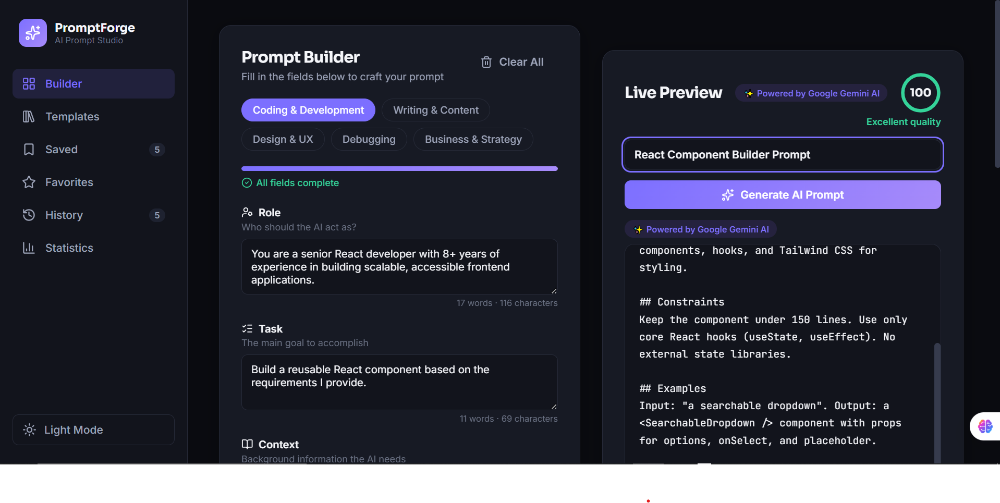
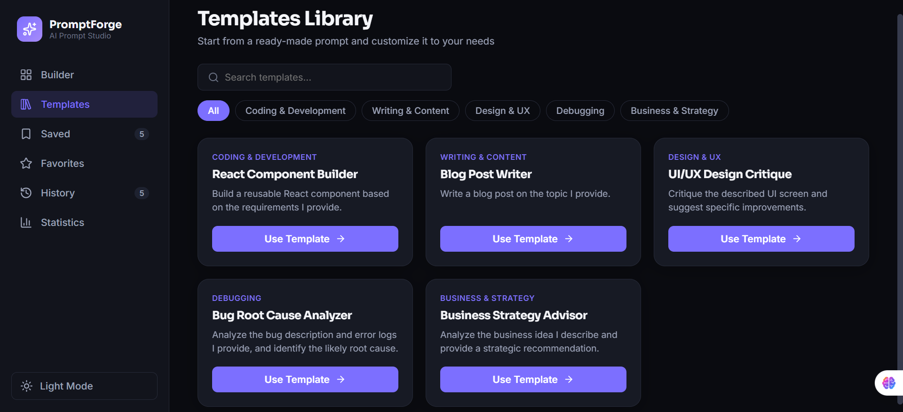
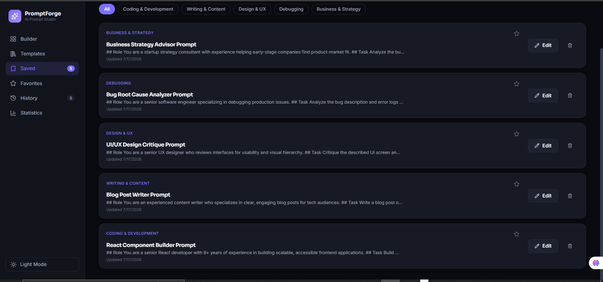
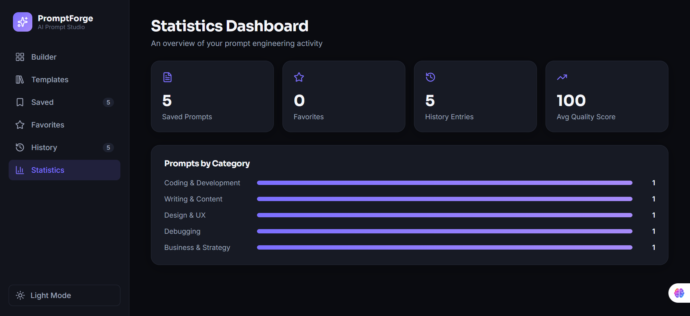
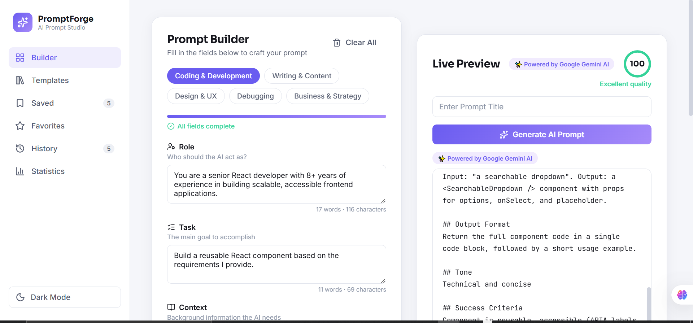

# 🧠 PromptForgeAI-InnoViast

An AI-powered Prompt Engineering Utility Platform that transforms simple ideas into professional, structured AI prompts — ready to use with ChatGPT, Claude, Gemini, and other AI tools.

🔗 **Live App:** https://prompt-forge-ai-inno-viast.vercel.app
📦 **Repository:** https://github.com/emankhanyusufzai/PromptForgeAI-InnoViast

---

## 📌 Problem Statement

Writing effective AI prompts is a skill most people don't have. Vague, unstructured prompts lead to inconsistent and low-quality AI responses. **PromptForgeAI** solves this by guiding users through a structured prompt-building process — covering role, task, context, constraints, examples, output format, tone, success criteria, and negative instructions — so anyone can generate professional-grade prompts in minutes, without needing prior prompt engineering experience.

---

## ✨ Features

| Feature | Description |
|---|---|
| 🧩 Guided Prompt Builder | 9 structured fields: Role, Task, Context, Constraints, Examples, Output Format, Tone, Success Criteria, Negative Instructions |
| 👁️ Live Prompt Preview | Real-time preview that updates as you type |
| 🤖 AI-Powered Generation | Enhances prompts using the Google Gemini API |
| 📊 Prompt Quality Score | Radial gauge that scores prompt completeness live |
| 📚 Templates Library | 5 ready-made templates: coding, writing, design, debugging, business |
| 💾 Save / Edit / Delete | Full CRUD on saved prompts using LocalStorage |
| ⭐ Favorites | Star your best prompts for quick access |
| 🕒 Prompt History | Automatic log of every prompt generated |
| 🔍 Search & Category Filters | Across both templates and saved prompts |
| 📤 Export Options | Copy to Clipboard, TXT, Markdown, and PDF |
| 📈 Statistics Dashboard | Saved prompts, favorites, history count, average quality score |
| 🔢 Word & Character Counters | On every input field |
| 📊 Progress Bar | Shows how much of the form is completed |
| 🌗 Dark / Light Mode | Full theme toggle, persisted across sessions |
| 🔔 Toast Notifications | Feedback on save, copy, export, and clear actions |
| 🧹 Clear All | Instantly reset the entire form |

---

## 🛠️ Tech Stack

- **Frontend:** React 18 + Vite
- **Styling:** Custom CSS design system (no framework dependency)
- **Icons:** Lucide React
- **PDF Export:** jsPDF
- **Notifications:** react-hot-toast
- **AI Integration:** Google Gemini API
- **Storage:** Browser LocalStorage (no backend required)
- **Deployment:** Vercel

---

## 🚀 Getting Started (Local Setup)

1. **Clone the repository:**
```bash
   git clone https://github.com/emankhanyusufzai/PromptForgeAI-InnoViast.git
   cd PromptForgeAI-InnoViast
```

2. **Install dependencies:**
```bash
   npm install
```

3. **Add your Gemini API key** in a `.env` file in the project root:
   VITE_GEMINI_API_KEY=your_api_key_here

4. **Run the development server:**

   npm run dev

5. Open **http://localhost:5173** in your browser.

---

## 📖 Usage Guide

1. Go to the **Builder** tab and select a category (Coding, Writing, Design, Debugging, or Business).
2. Fill in the 9 fields — each one directly shapes the final generated prompt.
3. Watch the **Live Preview** panel update in real time, along with your **Quality Score**.
4. Click **Generate AI Prompt** to have Gemini refine and enhance your prompt.
5. **Save** the prompt to reuse or edit later, or **export** it as TXT, Markdown, or PDF.
6. Browse the **Templates** tab to start from a ready-made prompt instead of a blank form.
7. Manage your work from **Saved**, **Favorites**, **History**, and **Statistics**.

---

## 📸 Screenshots

### 1. Prompt Builder with Live Preview


### 2. Templates Library


### 3. Saved Prompts


### 4. Statistics Dashboard


### 5. Light Mode View


## 🎓 Learnings

Building this project involved designing a flexible data model for prompts, implementing a real-time prompt generation engine, integrating a third-party AI API securely via environment variables, and building a fully custom, accessible dark/light theme system without relying on a CSS framework.

---

## 📄 License

Built as part of the InnoViast Internship Program (Task 3).